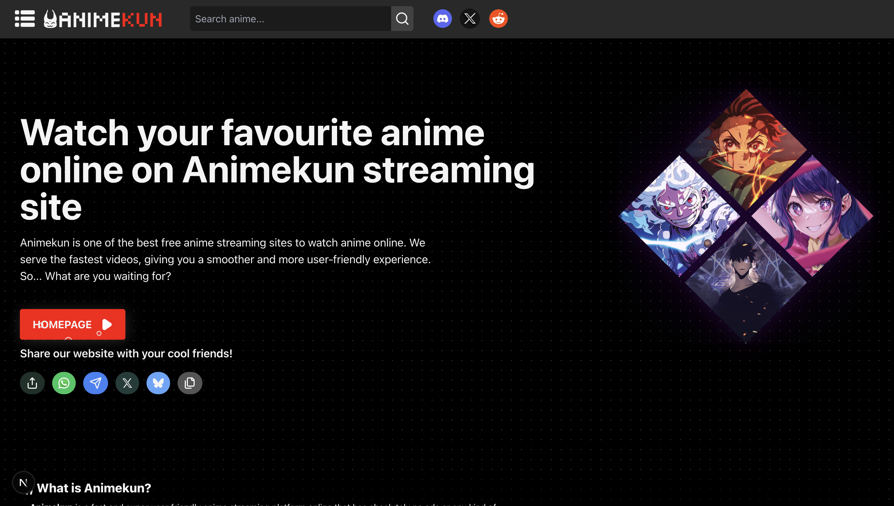

# Animekun 🎌

<div align="center">
  

  <p>
    <strong>A fast, sleek, and ad-free anime streaming web application.</strong>
  </p>

  <p>
    <a href="https://discord.gg/btsQafsQ4"></a>
    <a href="https://x.com/rammm2200"></a>
    <a href="https://nextjs.org/"></a>
    <a href="https://react.dev/"></a>
  </p>

  <p>
    <a href="https://animekonx.vercel.app/"><strong>🌐 Live Website: https://animekonx.vercel.app/</strong></a>
  </p>
</div>

---

## ✨ Features

- 🚀 **Zero Ads & No Sign-up Required:** Jump straight into streaming your favorite anime without interruptions, pop-ups, or login barriers.
- ⚡ **Multi-Provider Streaming Engine:**
  - **MegaPlay API** (`megaplay.buzz`) - High speed Anikoto, MAL & AniList streaming.
  - **TryEmbed API** (`tryembed.us.cc`) - Interactive anime embed with state broadcast.
  - **AnimePahe (VidNest)** (`vidnest.fun`) - High quality Sub & Dub streams.
  - **ReCloud Multi-Server** (`cdn.4animo.xyz`) - 4 distinct mirror nodes (HD-1, HD-2, HD-3, HD-4).
- 🎬 **Advanced Video Experience:**
  - Responsive Artplayer integration.
  - Auto-next episode playback with unified postMessage event bridge.
  - Seamless Sub / Dub audio track switching.
- 🔍 **Rich Catalog & Discovery:**
  - Powered by **AniList GraphQL** & **Jikan API**.
  - Spotlight trending carousels, airing schedules, genre filters, and category lists.
  - Full search with instant debounced queries.
- 📱 **Fully Responsive & PWA Ready:** Beautiful, dark-mode glassmorphic interface tailored for mobile, tablet, and desktop screens.

---

## 🛠️ Tech Stack

- **Framework:** [Next.js 16](https://nextjs.org/) (App Router & Turbopack)
- **UI Library:** [React 19](https://react.dev/)
- **Styling:** [Tailwind CSS 3](https://tailwindcss.com/) + [Radix UI](https://www.radix-ui.com/)
- **Player & Media:** [Artplayer](https://artplayer.org/), [Hls.js](https://github.com/video-dev/hls.js), Custom Iframe Embeds
- **Icons & Animation:** [Lucide React](https://lucide.dev/), [Framer Motion](https://www.framer.com/motion/)
- **Data APIs:** AniList GraphQL, Jikan Moe, Anikoto, AnimeNewsNetwork

---

## 🚀 Getting Started

### Prerequisites
- Node.js 18.18+ or 20+
- npm, yarn, or pnpm

### Installation

1. **Clone the repository:**
   ```bash
   git clone https://github.com/your-username/Animekun.git
   cd Animekun
   ```

2. **Install dependencies:**
   ```bash
   npm install
   ```

3. **Start the development server:**
   ```bash
   npm run dev
   ```

4. **Open in browser:**
   Navigate to [http://localhost:3000](http://localhost:3000)

---

## 📦 Production Build & Deployment

To create an optimized production build:

```bash
npm run build
npm start
```

### Deploy to Vercel

1. Push your repository to GitHub / GitLab.
2. Import the repository into [Vercel](https://vercel.com).
3. The framework preset is automatically detected as **Next.js**.
4. Click **Deploy**.

---

## 🤝 Community & Support

- **Discord:** [Join the Community](https://discord.gg/btsQafsQ4)
- **Twitter / X:** [@rammm2200](https://x.com/rammm2200)

---

## ⚖️ Disclaimer

Animekun does not store, host, or upload any media files on its servers. All media content and video streams are provided and hosted by non-affiliated third-party services.
